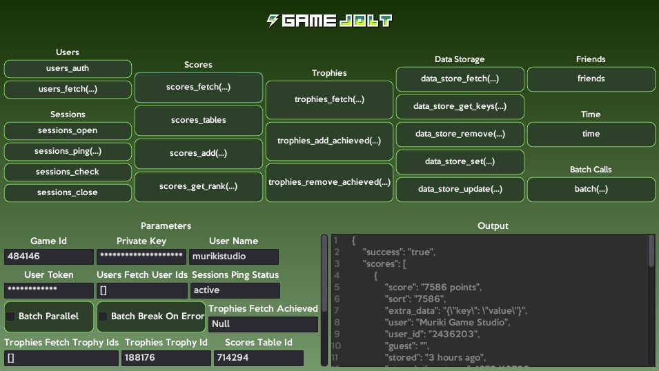

<p align="center">
  
</p>
<h1 align="center">Game Jolt API for Godot</h1>

Wrapper for the Game Jolt API running through HTTP requests. It contains all Game Jolt API endpoints and aims to simplify its use where it's possible. Compatible with **Godot 4.x**. For the Godot 3.x version, see [this](https://github.com/murikistudio/game-jolt-api/tree/godot-3) branch.

For examples of use, see the [documentation](#documentation) below. There's also an example scene in `addons/gamejolt/example` containing all endpoints and parameters on a graphical interface.

<p align="center">
  
</p>

## Documentation
**Note:** Any parameter followed by an `?` is optional.
Example: `sessions_ping(status?) -> GameJolt`.

#### Index
- [Signals](#signals)
- [General](#general)
- [Users](#users)
- [Sessions](#sessions)
- [Scores](#scores)
- [Trophies](#trophies)
- [Data Storage](#data-storage)
- [Friends](#friends)
- [Time](#time)
- [Batch Calls](#batch-calls)

#### Initial Setup
- Enable the plugin on `Project Settings > Plugins`
- Set the game ID and private key to be able to perform API requests on `Project Settings > General > Game Jolt > Config > Global`.
- Optionally, you can set a default user name and token on `Project Settings > General > Game Jolt > Config > Debug`.
    - Those properties will only be used as defaults on editor and debug builds, allowing easier testing and prototyping.
    - On release builds you must set the user name and token manually. See [General](#general) methods.

After this setup you can perform the API requests by using the methods below on the singleton `GameJolt` on your code.

#### Handling Request Responses
Each Game Jolt API method emits a signal after a request is completed, be it successful or not.
You can connect specific signals to capture responses on method callbacks:

```gdscript
func _ready() -> void:
    GameJolt.connect("time_completed", self, "_on_GameJolt_time_completed")
    GameJolt.time()


func _on_GameJolt_time_completed(result: Dictionary) -> void:
    # Do something with the request result...
```

Or you can `yield` the method result in a variable:

```gdscript
func _onButtonTime_pressed() -> void:
    var result: Dictionary = yield(GameJolt.time(), "time_completed")
    # Do something with the request result...
```

**Note:** All signals return a `response: Dictionary`.

### Signals
#### General
- `user_name_changed`
- `user_token_changed`
- `game_id_changed`
- `private_key_changed`

#### Users
- `users_fetch_completed(response: Dictionary)`
- `users_auth_completed(response: Dictionary)`

#### Sessions
- `sessions_open_completed(response: Dictionary)`
- `sessions_ping_completed(response: Dictionary)`
- `sessions_check_completed(response: Dictionary)`
- `sessions_close_completed(response: Dictionary)`

#### Scores
- `scores_fetch_completed(response: Dictionary)`
- `scores_tables_completed(response: Dictionary)`
- `scores_add_completed(response: Dictionary)`
- `scores_get_rank_completed(response: Dictionary)`

#### Trophies
- `trophies_fetch_completed(response: Dictionary)`
- `trophies_add_achieved_completed(response: Dictionary)`
- `trophies_remove_achieved_completed(response: Dictionary)`

#### Data Storage
- `data_store_set_completed(response: Dictionary)`
- `data_store_update_completed(response: Dictionary)`
- `data_store_remove_completed(response: Dictionary)`
- `data_store_fetch_completed(response: Dictionary)`
- `data_store_get_keys_completed(response: Dictionary)`

#### Friends
- `friends_completed(response: Dictionary)`

#### Time
- `time_completed(response: Dictionary)`

#### Batch Calls
- `batch_completed(response: Dictionary)`

### General
General methods to configure `GameJolt` singleton locally.

#### set_user_name(value)
Set the user name for auth and other user scope tasks. Emits `user_name_changed`.

- `value: String` -> The user name.

#### get_user_name() -> String
Get current user name.

#### set_user_token(value)
Set the user token for auth and other user scope tasks. Emits `user_token_changed`.

- `value: String` -> The user game token.

#### get_user_token() -> String
Get current user game token.

#### set_game_id(value)
Set the game ID needed for all tasks. Emits `game_id_changed`.

- `value: String` -> The game ID from your Game Jolt project.

#### get_game_id() -> String
Get current game ID.

#### set_private_key(value)
Set the private key needed for all tasks. Emits `private_key_changed`.

- `value: String` -> The game private key from your Game Jolt project.

#### get_private_key() -> String
Get current game private key.

### Users
#### [users_fetch](https://gamejolt.com/game-api/doc/users/fetch)(user_name?, user_ids?) -> GameJolt
Returns a user's data.
Emits `users_fetch_completed`.

- `user_name: String` (optional) -> The username of the user whose data you'd like to fetch.
- `user_ids: Array[String|int]` (optional) -> The IDs of the users whose data you'd like to fetch.

**Note:** The parameters `user_name` and `user_ids` are mutually exclusive, you should use only one of them, or none.
If none were provided, will fetch from the current user name set in `GameJolt` singleton.

#### [users_auth](https://gamejolt.com/game-api/doc/users/auth)() -> GameJolt
Authenticates the user's information.
This should be done before you make any calls for the user, to make sure the user's credentials (username and token) are valid.
The user name and token must be set on `GameJolt` singleton for it to succeed.
Emits `users_auth_completed`.

### Sessions
#### [sessions_open](https://gamejolt.com/game-api/doc/sessions/open)() -> GameJolt
Opens a game session for a particular user and allows you to tell Game Jolt that a user is playing your game.
You must ping the session to keep it active and you must close it when you're done with it.
Emits `sessions_open_completed`.

**Notes:**
- You can only have one open session for a user at a time. If you try to open a new session while one is running, the system will close out the current one before opening the new one.
- Requires user name and token to be set on `GameJolt` singleton.

#### [sessions_ping](https://gamejolt.com/game-api/doc/sessions/ping)(status?) -> GameJolt
Pings an open session to tell the system that it's still active.
If the session hasn't been pinged within 120 seconds, the system will close the session and you will have to open another one.
It's recommended that you ping about every 30 seconds or so to keep the system from clearing out your session.
You can also let the system know whether the player is in an `"active"` or `"idle"` state within your game.
Emits `sessions_ping_completed`.

- `status: String` (optional) -> Sets the status of the session to either `"active"` or `"idle"`.

**Note:** Requires user name and token to be set on `GameJolt` singleton.

#### [sessions_check](https://gamejolt.com/game-api/doc/sessions/check)() -> GameJolt
Checks to see if there is an open session for the user.
Can be used to see if a particular user account is active in the game.
Emits `sessions_check_completed`.

**Notes:**
- This endpoint returns `false` for the `"success"` field when no open session exists. That behaviour is different from other endpoints which use this field to indicate an error state.
- Requires user name and token to be set on `GameJolt` singleton.

#### [sessions_close](https://gamejolt.com/game-api/doc/sessions/close)() -> GameJolt
Closes the active session.
Emits `sessions_close_completed`.

**Note:** Requires user name and token to be set on `GameJolt` singleton.

### Scores
#### [scores_fetch](https://gamejolt.com/game-api/doc/scores/fetch)(limit?, table_id?, guest?, better_than?, worse_than?, this_user?) -> GameJolt
Returns a list of scores either for a user or globally for a game.
Emits `scores_fetch_completed`.

- `limit: String|int` (optional) -> The number of scores you'd like to return.
- `table_id: String|int` (optional) -> The ID of the score table.
- `guest: String` (optional) -> A guest's name.
- `better_than: String|int` (optional) -> Fetch only scores better than this score sort value.
- `worse_than: String|int` (optional) -> Fetch only scores worse than this score sort value.
- `this_user: bool` (optional) -> If `true`, fetch only scores of current user. Else, fetch scores of all users.

**Notes:**
- Requires user name and token to be set on `GameJolt` singleton if `this_user` is `true`.
- The default value for `limit` is `10` scores. The maximum amount of scores you can retrieve is `100`.
- If ``table_id`` is left blank, the scores from the primary score table will be returned.
- Only pass in `this_user` as `true` if you would like to retrieve scores for just the user set in the class constructor. Leave `this_user` as `true` and `guest` as `""` to retrieve all scores.
- `guest` allows you to fetch scores by a specific guest name. Only pass either the `this_user` as `true` or the `guest` (or none), never both.
- Scores are returned in the order of the score table's sorting direction. e.g. for descending tables the bigger scores are returned first.

#### [scores_tables](https://gamejolt.com/game-api/doc/scores/tables)() -> GameJolt
Returns a list of high score tables for a game.
Emits `scores_tables_completed`.

#### [scores_add](https://gamejolt.com/game-api/doc/scores/add)(score, sort, table_id?, guest?, extra_data?) -> GameJolt
Adds a score for a user or guest.
Emits `scores_add_completed`.

- `score: String` -> This is a string value associated with the score. Example: `"500 Points"`.
- `sort: String|int` -> This is a numerical sorting value associated with the score. All sorting will be based on this number. Example: `500`.
- `table_id: String|int` (optional) -> The ID of the score table to submit to.
- `guest: String` (optional) -> The guest's name. Overrides the `GameJolt` singleton's user name.
- `extra_data: String|int|Dictionary|Array` (optional) -> If there's any extra data you would like to store as a string, you can use this variable.

**Notes:**
- You can either store a score for a user or a guest. If you're storing for a user, you must set user name and toke on `GameJolt` singleton and leave `guest` as empty. If you're storing for a guest, you must pass in the `guest` parameter.
- The `extra_data` value is only retrievable through the API and your game's dashboard. It's never displayed publicly to users on the site. If there is other data associated with the score such as time played, coins collected, etc., you should definitely include it. It will be helpful in cases where you believe a gamer has illegitimately achieved a high score.
- If `table_id` is left blank, the score will be submitted to the primary high score table.

#### [scores_get_rank](https://gamejolt.com/game-api/doc/scores/get-rank)(sort, table_id?) -> GameJolt
Returns the rank of a particular score on a score table.
Emits `scores_get_rank_completed`.

- `sort: String|int` -> This is a numerical sorting value that is represented by a rank on the score table.
- `table_id: String|int` (optional) -> The ID of the score table from which you want to get the rank.

**Notes:**
- If `table_id` is left blank, the ranks from the primary high score table will be returned.
- If the score is not represented by any rank on the score table, the request will return the rank that is closest to the requested score.

### Trophies
#### [trophies_fetch](https://gamejolt.com/game-api/doc/trophies/fetch)(achieved?, trophy_ids?) -> GameJolt
Returns one trophy or multiple trophies, depending on the parameters passed in.
Emits `trophies_fetch_completed`.

- `sort: bool|null` (optional) -> Pass in `true` to return only the achieved trophies for a user. Pass in `false` to return only trophies the user hasn't achieved. Pass `null` to retrieve all trophies.
- `trophy_ids: Array[String|int]` (optional) -> If you would like to return one or multiple trophies, pass trophy IDs here if you want to return a subset of all the trophies.

**Notes:**
- Passing `trophy_ids` will ignore the `achieved` parameter if it is passed.
- Requires user name and token to be set on `GameJolt` singleton.

#### [trophies_add_achieved](https://gamejolt.com/game-api/doc/trophies/add-achieved)(trophy_id) -> GameJolt
Sets a trophy as achieved for a particular user.
Emits `trophies_add_achieved_completed`.

- `trophy_id: String|int` -> The ID of the trophy to add for the user.

**Note:** Requires user name and token to be set on `GameJolt` singleton.

#### [trophies_remove_achieved](https://gamejolt.com/game-api/doc/trophies/remove-achieved)(trophy_id) -> GameJolt
Remove a previously achieved trophy for a particular user.
Emits `trophies_remove_achieved_completed`.

- `trophy_id: String|int` -> The ID of the trophy to remove from the user.

**Note:** Requires user name and token to be set on `GameJolt` singleton.

### Data Storage
#### [data_store_set](https://gamejolt.com/game-api/doc/data-store/set)(key, data, global_data?) -> GameJolt
Sets data in the data store.
Emits `data_store_set_completed`.

- `key: String` -> The key of the data item you'd like to set.
- `data: String|Array|Dictionary` -> The data you'd like to set.
- `global_data: bool` (optional) -> If set to `true`, ignores user name and token set in `GameJolt` and processes global data instead of user data.

**Notes:**
- You can create new data store items by passing in a key that doesn't yet exist in the data store.
- If `global_data` is `false`, requires user name and token to be set on `GameJolt` singleton.

#### [data_store_update](https://gamejolt.com/game-api/doc/data-store/update)(key, operation, value, global_data?) -> GameJolt
Updates data in the data store.
Emits `data_store_update_completed`.

- `key: String` -> The key of the data item you'd like to update.
- `operation: String` -> The operation you'd like to perform.
- `value: String|int` -> The value you'd like to apply to the data store item.
- `global_data: bool` (optional) -> If set to `true`, ignores user name and token set in `GameJolt` and processes global data instead of user data.

**Notes:**
- Valid values for `operation`: `"add"`, `"subtract"`, `"multiply"`, `"divide"`, `"append"` and `"prepend"`.
- If `global_data` is `false`, requires user name and token to be set on `GameJolt` singleton.

#### [data_store_remove](https://gamejolt.com/game-api/doc/data-store/remove)(key, global_data?) -> GameJolt
Removes data from the data store.
Emits `data_store_remove_completed`.

- `key: String` -> The key of the data item you'd like to remove.
- `global_data: bool` (optional) -> If set to `true`, ignores user name and token set in `GameJolt` and processes global data instead of user data.

**Notes:**
- If `global_data` is `false`, requires user name and token to be set on `GameJolt` singleton.

#### [data_store_fetch](https://gamejolt.com/game-api/doc/data-store/fetch)(key, global_data?) -> GameJolt
Returns data from the data store.
Emits `data_store_fetch_completed`.

- `key: String` -> The key of the data item you'd like to fetch.
- `global_data: bool` (optional) -> If set to `true`, ignores user name and token set in `GameJolt` and processes global data instead of user data.

**Notes:**
- If `global_data` is `false`, requires user name and token to be set on `GameJolt` singleton.

#### [data_store_get_keys](https://gamejolt.com/game-api/doc/data-store/get-keys)(pattern?, global_data?) -> GameJolt
Returns either all the keys in the game's global data store, or all the keys in a user's data store.
Emits `data_store_get_keys_completed`.

- `pattern: String` (optional) -> The pattern to apply to the key names in the data store.
- `global_data: bool` (optional) -> If set to `true`, ignores user name and token set in `GameJolt` and processes global data instead of user data.

**Notes:**
- If you apply a pattern to the request, only keys with applicable key names will be returned. The placeholder character for patterns is `"*"`.
- This request will return a list of the `"key"` values. The `"key"` return value can appear more than once.
- If `global_data` is `false`, requires user name and token to be set on `GameJolt` singleton.

### Friends
#### [friends](https://gamejolt.com/game-api/doc/friends/fetch)() -> GameJolt
Returns the list of a user's friends.
Emits `friends_completed`.

**Note:** Requires user name and token to be set on `GameJolt` singleton.

### Time
#### [time](https://gamejolt.com/game-api/doc/time/fetch)() -> GameJolt
Returns the time of the Game Jolt server.
Emits `time_completed`.

### Batch Calls
A batch request is a collection of sub-requests that enables developers to send multiple API calls with one HTTP request.
To use batch calls in your code, place your request calls between a `batch_begin` and `batch_end`. For example, use your methods in the following order:

```gdscript
# Begin to gather batch requests
GameJolt.batch_begin()

# Add the time request to the batch
GameJolt.time()

# Add the scores_tables request to the batch
GameJolt.scores_tables()

# Stop gathering batch requests
GameJolt.batch_end()

# Perform the batch call with the two requests above (time and score_tables)
var result: Dictionary = yield(GameJolt.batch(), "batch_completed")
```

#### [batch](https://gamejolt.com/game-api/doc/batch)(parallel?, break_on_error?) -> GameJolt
Perform the batch request after gathering requests with `batch_begin` and `batch_end`.
Emits `batch_completed`.

- `parallel: bool` (optional) -> By default, each sub-request is processed on the servers sequentially. If this is set to `true`, then all sub-requests are processed at the same time, without waiting for the previous sub-request to finish before the next one is started.
- `break_on_error: bool` (optional) -> If this is set to `true`, one sub-request failure will cause the entire batch to stop processing subsequent sub-requests and return a value of `false` for success.

**Notes:**
- The maximum amount of sub requests in one batch request is 50.
- The `parallel` and `break_on_error` parameters are mutually exclusive and cannot be used in the same request.

#### batch_begin()
Begins to gather requests for batch. Methods **will not** return responses after this call.
Call `batch_end` to finish the batch request gathering process.

#### batch_end()
Stops gathering requests for batch. Methods **will** return responses again after this call.
Must be used after `batch_begin`.
